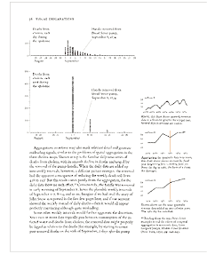

A Glasseye Demo
----------------

##What is glasseye?

Glasseye<sidenote>See the [github repository](https://github.com/coppeliaMLA/glasseye) for the source code</sidenote> is something I'm developing to present the results of statistical analysis in an attractive and hopefully interesting way.

Glasseye brings together three great things that I use a lot:

1. The markdown markup language.
2. The Tufte wide margin layout
3. Visualisation using d3.js

The idea is to be able to write up work in markdown<sidenote>Markdown is a lightweight markup language with a simple easy-to-use syntax. Text written in markdown can be converted into HTML as well as a many other formats</sidenote> and have the results transformed into something like a Tufte layout<sidenote>The Tufte layout makes extenive use of a wide margin to display notes, images and charts. </sidenote>. For the Tufte layout I took the excellent tufte.css style sheet developed by [Dave Liepmann and co](https://github.com/daveliepmann/tufte-css) and adapted it for my purposes. Finally I've added some d3 charts (just a small selection at the moment but this is growing) that can easily invoked from within the markdown.

Here's an example:  a d3 force directed graph, which can be easily added in to a glasseye document using html like tags.

<force>
	{ "nodes": [{ "name": "Brand X", "group": 1 }, { "name": "Brand Y", "group": 1 }, { "name": "Brand Z", "group": 1 }, { "name": "Agent 1", "group": 2 }, { "name": "Agent 2", "group": 2 }, { "name": "Agent 3", "group": 3 }, { "name": "Agent 4", "group": 3}, { "name": "Agent 5", "group": 2}, { "name": "Agent 6", "group": 2} , {"name": "Agent 7", "group": 2} , { "name": "Agent 8", "group": 2 } , { "name": "Agent 9", "group": 2 } , { "name": "Agent 10", "group": 2 } , { "name": "Agent 11", "group": 2 }], "links": [{ "source": 0, "target": 6, "value": 20 }, { "source": 1, "target": 4, "value": 30 }, { "source": 2, "target": 7, "value": 22 }, { "source": 6, "target": 11, "value": 5 }, { "source": 10, "target": 7, "value": 5 }, { "source": 3, "target": 8, "value": 15 }, { "source": 5, "target": 8, "value": 15 }, { "source": 5, "target": 9, "value": 15 }, { "source": 4, "target": 7, "value": 15 }, { "source": 10, "target": 6, "value": 15 }] }
</force>


##What it can do

In case it's not obvious this web page was written using glasseye<sidenote>You can view the markdown [here](viewMarkdown.txt)</sidenote>, that it is it was written in markdown with a few extra html-like tags thrown in.

###Side notes and margin notes
First there's the `<sidenote>` tag. Anything enclosed in these tags will generate a numbered side note in the wide margin as close as possible to the note number in the main text. For example, I've used one here.<sidenote>I'm a side note! Use me for commentary, links, bits of maths, anything that's peripheral to the main discussion.</sidenote>.

You can easily add images to the side notes and margin notes just by including the usual markdown syntax for inserting an image<sidenote>The syntax is ``</sidenote> within the tags.

Then there is a `<marginnote>` tag which is the nearly the same as the side note, only there's no number linking it to a particular part in the main text. You'll see to the right an example of a margin note containing a d3 donut chart.

<marginnote>
An example of margin note containing a donut plot. Because a tooltip is available we can create a less cluttered chart with labels for the smaller segments demoted to the tooltip.<donut>"data/share.csv"</donut>Including d3 charts in a glasseye document is very easy. You just need to surround the name of the file containing the data with tags specfying the type of chart. For example this chart was generated using `<donut>"data/share.csv"</donut>`
</marginnote>

###Latex

I'm using pandoc to convert the markdown to html which means we can take advantage of its ability to transform latex into mathjax. For example the formula below was written in latex.

$$E[L]= \frac{1}{B(\alpha)}\int \cdots \int_\mathbf{D}\ \sum_{j=1}^N \theta_{j}^2 \ \prod_{j=1}^N \theta_j^{\alpha_j-1} \ d\theta_1 \!\cdots d\theta_N $$

However sometimes the mathematical details are not central to a discussion, in which case it's nice to put them in a side note which can be easily done using the sidenote or marginnote tags<sidenote>
Here's an example of some maths that has been placed in a side note $$ f(\theta_1,\dots, \theta_N; \alpha_1,\dots, \alpha_N) = \frac{1}{\mathrm{B}(\alpha)} \prod_{i=1}^N \theta_i^{\alpha_i - 1} $$
Where the normalising constant is:
$$ \mathrm{B}(\alpha) = \frac{\prod_{i=1}^N \Gamma(\alpha_i)}{\Gamma\bigl(\sum_{i=1}^N \alpha_i\bigr)},\qquad\alpha=(\alpha_1,\dots,\alpha_N)$$
</sidenote>

###d3 charts

I've tried to create charts that are simple and uncluttered with the tooltip taking over some of the work. This is so that they can fit in the margin nicely. I've been thinking about making them as intellegent as possible so that choices are made for you about formatting (for example label positioning). That may prove annoying though so we'll see how it goes. It's easy to include any of the d3 charts into either the main body of the text or into the margin.

Inserting a plot is again just a matter of using some custom tags. For example to generate a line plot just surround a string containing the path and filname of a csv file with a `<lineplot>` tag. You can optionally supply axis labels.<sidenote>
An example of a line plot. Note the tooltip means we don't need y axis tick labels.
<lineplot>"data/lineplotExample.csv", ["Size", "Number of explosions"]</lineplot>
This plot was created by inserting the following line into the markdown. `<lineplot>"data/lineplotExample.csv", ["Size", "Number of explosions"]</lineplot>
`

Alternatively you can write the data in json into the markdown. For example we can create an interactive treemap<sidenote>An example of an intreactive treemap. Click on the rectangles to zoom in <treemap>{ "name": "All", "children": [{ "name": "Bakery", "size": 34 }, { "name": "Tinned Goods", "children": [{ "name": "Beans", "size": 34 }, { "name": "Soups", "size": 56 }, { "name": "Puddings", "children": [{ "name": "Fruit", "children": [{ "name": "Tangerines", "size": 15 }, { "name": "Pears", "size": 17 }]}, { "name": "Apricots", "size": 89 } ] }] }, { "name": "Meat and Fish", "children": [{ "name": "Meat", "children": [{ "name": "Poultry", "size": 15 }, { "name": "Beef", "size": 17 }]}, { "name": "Fish", "size": 89 } ] }] }</treemap>
</sidenote>
 by inserting the following into the markdown<sidenote>See the section below for the full json</sidenote>

```

<treemap>
{
    "name": "All",
    "children": [
        {"name": "Bakery",
         "size": 34},
        {"name": "Tinned Goods",
         "children": [
                {"name": "Beans",
                 "size": 34},
                {"name": "Soups",
                 "size": 56},
                {"name": "Puddings",
                 "children": [
                        {"name": "Fruit",
                         "children": [
                               	{"name": "Tangerines",
                                 "size": 15},
                                {"name": "Pears",
                                 "size": 17}
                            ]
                        },
                        {"name": "Apricots",
                         "size": 89}
...
</treemap>
```

Javascript charts also allow us to animate content which can be useful. I created a chart type `<sim_plot>` for a project using agent based simulation. It animates a time line which helps bring home the fact that the data is computer generated

<simplot>"data/activeDecidedSim.csv"</simplot>

##How it works

Glasseye is built using pandoc and the python beautifulsoup library. Pandoc is used to generate the html from the markdown and beautifulsoup is used to manipulate the extra tags and make the appropriate substitutions, including adding in the d3 charts.

##Installing glasseye

I've now added glasseye to pip so installation is fairly straightforward

1. Install pandoc from [here](http://pandoc.org)
2. If you don't have it already install python 2.7
3. Then from the command line run `pip install glasseye` <sidenote>Assumes you already have the pip package. If you don't just run `easy_install pip`</sidenote>

##Using glasseye

Just create your markdown file using a text editor and then from the commandline run<sidenote>Don't forget to include the path of the markdown file if you are not actually in its directory</sidenote>

```
glasseye myMarkdownFile.md
```
The html will then be created in the current directory along with the supporting css and javascript.

You can test it out using the demo that comes with the package. You'll find the demo files in `path_to_your_packages/glasseye/demo`. Copy them to a new directory and run

```
glasseye markdownExample.md
```


##The charts

In no particular order here are the d3 charts I have added so far.<sidenote>You might be wondering why I've added these charts when there are so many basic charts that I haven't yet included. The answer is quite selfish. I'm just adding them as I need them. More will follow!</sidenote>. Some of them can be generated from csv files some from inline json, some from both. The aim is for all to be generated from both.

###A Venn diagram

I've used Ben Frederickson's [Venn.js](https://github.com/benfred/venn.js) package for laying out proportional Venn diagrams. It searches for the best possible representation and does a great job when there's three sets and quite often when there's four.<sidenote>A description of the algorithm he uses can be found on his [blog](http://www.benfrederickson.com/venn-diagrams-with-d3.js/)</sidenote>

You'll just need to put the json describing your sets between `<venn>` tags as in this example. The result can be seen in the margin.<sidenote>An example of a proportional Venn diagram created using Ben Frederickson's [Venn.js](https://github.com/benfred/venn.js) package <venn>
[ {sets: ['Badgers'], size: 300},
  {sets: ['Peanuts'], size: 42},
  {sets: ['Mushrooms'], size: 130},
  {sets: ['Badgers','Mushrooms'], size: 67},
  {sets: ['Peanuts','Mushrooms'], size: 2},
  {sets: ['Peanuts','Badgers'], size: 0}
 ]
</venn>
</sidenote>


```

<venn>
[ {sets: ['Badgers'], size: 300},
  {sets: ['Peanuts'], size: 42},
  {sets: ['Mushrooms'], size: 130},
  {sets: ['Badgers','Mushrooms'], size: 67},
  {sets: ['Peanuts','Mushrooms'], size: 2},
  {sets: ['Peanuts','Badgers'], size: 0}
 ]
</venn>
```

###A tree layout

This ia a fairly standard layout for a hierarchy, adapated from Mike Bostocks [original design](http://bl.ocks.org/mbostock/4063570).

<tree>
{"name": "root", "children": [{ "name": "purpledog.com" }, { "name": "squishedfish.co.uk" }, { "name": "blogs", "children": [{ "name": "political", "children": [{ "name": "flatbat.com" }, { "name": "netfrog.co.uk" }]}, { "name": "squarespider.com" } ] }]}
</tree>


Like all of the charts it can appear in the main body or in the margin.<sidenote>The same tree layout as it appears in the margin.<tree>
{"name": "root", "children": [{ "name": "purpledog.com" }, { "name": "squishedfish.co.uk" }, { "name": "blogs", "children": [{ "name": "political", "children": [{ "name": "flatbat.com" }, { "name": "netfrog.co.uk" }]}, { "name": "squarespider.com" } ] }]}
</tree></sidenote>

To create a treelayout include some nested json within the tree tags.

```

<tree>
{
    "name": "root",
    "children": [
        {"name": "purpledog.com"},
        {"name": "squishedfish.co.uk"},
        {"name": "blogs",
         "children": [
                {"name": "political",
                 "children": [
                        {"name": "flatbat.com"},
                        {"name": "netfrog.co.uk"}
                    ]
                },
                {"name": "squarespider.com"}
            ]
        }
    ]
}
</tree>
```

###A simple bar chart

A simple bar chart can be created using the barchart tags.<sidenote>
A bar chart as it appears in the margin.
<barchart>
{"label": ["Apples", "Pears", "Oranges"], "value": [33, 12, 9]}
</barchart>
</sidenote>

```

<barchart>
{"label": ["Apples", "Pears", "Oranges"], "value": [33, 12, 9]}
</barchart>
```


###A force directed layout

Another fairly standard chart in the d3 world, you can create a force directed layout of a graph using the force tags and some json.<sidenote>
A force directed layout of a graph.
<force>
	{ "nodes": [{ "name": "squishedfish.com", "group": 1 }, { "name": "reddog.co.uk", "group": 1 }, { "name": "blankcat.com", "group": 2 }, { "name": "scrimpledfeet.com", "group": 2 }, { "name": "sickbag.com", "group": 2 }, { "name": "bluehouse.co.uk", "group": 3 }, { "name": "webbedcat.com", "group": 3 }, { "name": "flatrhino.co.uk", "group": 1 }, { "name": "greycamel.com", "group": 3 }  ], "links": [{ "source": 0, "target": 1, "value": 20 }, { "source": 0, "target": 2, "value": 30 }, { "source": 1, "target": 4, "value": 22 }, { "source": 6, "target": 2, "value": 5 }, { "source": 1, "target": 7, "value": 5 }, { "source": 3, "target": 8, "value": 15 }, { "source": 5, "target": 8, "value": 15 }] }
</force>
</sidenote>

```

<force>
	{
    "nodes": [
        {"name": "squishedfish.com", "group": 1},
        {"name": "reddog.co.uk", "group": 1},
        {"name": "blankcat.com", "group": 2},
        {"name": "scrimpledfeet.com", "group": 2},
        {"name": "sickbag.com", "group": 2},
        {"name": "bluehouse.co.uk", "group": 3},
        {"name": "webbedcat.com", "group": 3},
        {"name": "flatrhino.co.uk","group": 1},
        {"name": "greycamel.com", "group": 3}
    ],
    "links": [
    	{ "source": 0, "target": 1, "value": 20 },
    	{ "source": 0, "target": 2, "value": 30 },
    	{ "source": 1, "target": 4, "value": 22 },
    	{ "source": 6, "target": 2, "value": 5 },
    	{ "source": 1, "target": 7, "value": 5 },
    	{ "source": 3, "target": 8, "value": 15 },
    	{ "source": 5, "target": 8, "value": 15 }
    	]
    }
</force>
```


###A gantt chart

I find a simple version of a Gantt chart useful when creating plans and proposals. It gives a rough idea of the time scales involved. The syntax is as follows:

```
<gantt>
		[{"task": "Analysis phase", "start": "01/03/2015", "end": "12/03/2015"},
		{"task": "Build phase", "start": "13/03/2015", "end": "24/03/2015"},
		{"task": "Testing phase", "start": "25/03/2015", "end": "15/04/2015"}]
</gantt>
```

This will give you the following

<gantt>
		[{"task": "Analysis phase", "start": "01/03/2015", "end": "12/03/2015"},
		{"task": "Build phase", "start": "13/03/2015", "end": "24/03/2015"},
		{"task": "Testing phase", "start": "25/03/2015", "end": "15/04/2015"}]
</gantt>


###A donut chart

As seen above, you can create a donut plot from a csv file (you just need columns with headings `label` and `value`). Alternatively you can use inline json as in this example.<sidenote>
A donut created from inline json.
<donut>
{"labels":["Cats", "Dogs", "Monkeys", "Cabbages"], "values": [100, 34, 22, 76]}
</donut>
</sidenote>

```

<donut>
{
	"label":["Cats", "Dogs", "Monkeys", "Cabbages"],
 	"values": [100, 34, 22, 76]
 }
</donut>
```

###A line chart

Similarly the line chart can be either created from a csv file (as long as it has columns with heading x and y) or from in line json. Here is an example.

```

<lineplot>
	{
		"x": [1, 3, 5, 6, 20, 22, 25],
		"y": [100, 98, 66, 43, 23, 22, 45]
	}
</lineplot>
```

<lineplot>{"x": [1, 3, 5, 6, 20, 22, 25], "y": [100, 98, 66, 43, 23, 22, 45]}</lineplot>

###A tree map

At present the treemap can only be generated from inline json. Here's the full json.

```

<treemap>
{
    "name": "All",
    "children": [
        {"name": "Bakery",
         "size": 34},
        {"name": "Tinned Goods",
         "children": [
                {"name": "Beans",
                 "size": 34},
                {"name": "Soups",
                 "size": 56},
                {"name": "Puddings",
                 "children": [
                        {"name": "Fruit",
                         "children": [
                               	{"name": "Tangerines",
                                 "size": 15},
                                {"name": "Pears",
                                 "size": 17}
                            ]
                        },
                        {"name": "Apricots",
                         "size": 89}
                         		] }] },
                { "name": "Meat and Fish",
                   "children": [
                   		{ "name": "Meat",
                   		  "children": [
                   		  		{ "name": "Poultry",
                   		  		  "size": 15 },
                   		  		{ "name": "Beef",
                   		  		  "size": 17 }
                   		  		       ]},
                        { "name": "Fish",
                          "size": 89 }
                                ]
                }
            ]
}
</treemap>
```
